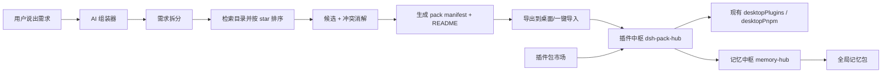

# DSH 插件包系统（插座包 v0.1）具体规划

> 结论先行：讨论中的「插座包」方案成立，而且 dsh 桌面端已经具备其中 80% 的地基。插件包应该做成一个**组合层**，而不是第二套插件标准；真正要新建的是「包中枢 + AI 组装器 + 记忆中枢」，市场、安装、更新全部复用现有能力。

## 1. 现状盘点：我们手里已经有什么

本地已有 dsh 桌面工程（`）。关键事实：

| 能力 | 现状 | 结论 |
| --- | --- | --- |
| 插件安装/卸载 | `dsh-community-market` 已内置：发现/可安装/已安装/来源四视图，精确 npm 版本安装、receipt 卸载、启用/禁用、配置级恢复 | 包中枢直接调用，不重写 |
| 目录来源 | 已实现公开目录契约 v1，内置 DSH 1024Store 与 dshfind 适配器；用户可添加标准来源 | 插件包目录接同一契约 |
| bundle 管理 | `desktop-plugins.js` 管理 profile 的 `dsh.profile.bundles`，禁用状态持久化到用户数据目录 | 包的激活/停用映射到 bundle 集合 |
| DSH 更新 | `desktop-updates` 已存在 | 自检面板直接暴露，不另做更新器 |
| profile | `desktopProfiles` 服务已存在 | 包只作用于当前 profile，切换由现有机制负责 |

**一个重要结论**：不要定义「第二套插件格式」。「插座包」不是新的运行时，而是 `pack manifest + 一组 bundle + 可选记忆包 + 冲突矩阵` 的组合层。这样既保住上游兼容性，也保住明天可开源的生态位。

## 2. 目标架构



三个中枢 + 一个 AI 组装器：

- **插件包市场**：发现、评分、安装入口。第一版直接扩展现有 `dsh-community-market`，把「包」作为目录条目。
- **插件中枢**：pack 的导入、自检、激活/停用、更新、冲突管理、包 receipt。
- **记忆中枢**：全局记忆包，与 profile 解耦，AI 可调用。
- **AI 组装器**：需求 -> 搜索 -> 组装 -> 导出 -> 一键导入。

## 3. 插件包格式规范 v0.1

每个插座包是一个 npm 包或本地 `.dshpack.json`，格式如下：

```json
{
  "packId": "cn.dshpack.research",
  "name": "科研插座包",
  "version": "1.0.0",
  "scene": "research",
  "tags": ["科研", "论文", "AI工具"],
  "requires": {
    "dsh": "0.1.0-rc.7",
    "node": ">=22.19.0",
    "profile": "desktop"
  },
  "bundles": [
    {
      "package": "@dsh-community/dsh-tool-literature",
      "version": "1.2.3",
      "role": "literature",
      "source": "npm"
    }
  ],
  "conflicts": [
    {
      "package": "@old/dsh-literature",
      "reason": "repeat-tool",
      "replaceWith": "@dsh-community/dsh-tool-literature"
    }
  ],
  "memory": [
    {
      "memoryPackId": "global.research",
      "keywords": ["论文", "文献", "引用"]
    }
  ],
  "configDir": "packs/cn.dshpack.research",
  "market": {
    "author": "Arito",
    "license": "MIT",
    "stars": 2840,
    "source": "https://github.com/example/research-pack"
  }
}
```

字段职责：

- `bundles`：全部引用现有 npm 插件，必须精确版本，不能是 GitHub URL 或版本范围，否则沿用市场 fail-closed 拒绝。
- `conflicts`：包宿主预先声明已知冲突，AI 组装器也必须动态生成冲突矩阵。
- `memory`：声明该包要激活的全局记忆包，记忆本体不放进 profile。
- `configDir`：包级配置目录，位于用户数据区，切换包时配置可恢复、可导出。

## 4. 插件中枢实现方案

新增 monorepo package：`dsh-pack-hub`，结构照抄 `dsh-community-market` 的 Host/Client 分界：

```text
dsh-pack-hub/
  src/
    host/
      index.ts        # routes + 状态 + 自检 + 安装编排
      preflight.ts    # 依赖/兼容性/冲突矩阵
      receipt.ts      # pack receipt 持久化
      import.ts       # 本地 .dshpack.json / 未来 git 包导入
      updater.ts      # 调用 desktop-updates 暴露 DSH 版本与更新
    client/
      index.tsx       # Tab + 侧边栏入口
  cordis.patch.yml
  package.json
```

接入点：`cordis.patch.yml` 中在 `community-market` 之后插入 `dsh-pack-hub`，`inject` 复用 `desktopPlugins`、`desktopProfiles`、`desktopPnpm`、`desktopUpdates`。状态文件：

```text
<userData>/pack-hub/state.json             # 已装入的包、激活状态、pack receipt
<userData>/pack-hub/packs/<packId>/config.json   # 包级配置
<userData>/memory-hub/<memoryPackId>/     # 全局记忆包
```

安装一个包的执行流：

1. 解析并校验 manifest。
2. Preflight：检查 `requires`、精确 npm 版本、冲突矩阵、当前 profile 状态。
3. 逐 bundle 调用现有受管安装（`desktopPnpm.runPlugin`），沿用配置级快照与恢复。
4. 全部成功后再写 pack receipt，失败则回滚已识别的配置状态。
5. 用户确认后一次性重启，不静默重启。

热插拔语义：切换包只切换一组 bundle 的启用/停用（现有 `desktopPlugins` 能力），下一次 generation 生效；记忆包始终全局，不随切换丢失。

## 5. 插件包市场

不在市场第一版自建后台。两条路径：

1. **目录条目路径**：插件包作者把包发布为 npm 包（内含 `.dshpack.json`），提交到符合目录契约 v1 的「包目录源」；市场像现有插件一样完成验证、安装。
2. **适配器路径**：如果 1024Store/dshfind 无法直接表达「包」，为包列表增加一个受审 adapter，把 pack 元数据标准化成目录条目并保留 provenance。

上传与审核：v1 用 GitHub 仓库 + 目录收录，不搞账号、排行榜、付费。每个包条目展示 star、维护者、标签、插件数、冲突提示。AI 组装器搜索时优先使用目录的 star/评分，目录缺 star 时用 GitHub API 补充，但仅作为「展示排名」，不作为安全背书。

## 6. AI 组装器

做成 DSH Agent 的一个 tool/skill，不用新建后台服务：

1. **需求拆分**：把用户一句话拆成场景、核心任务、工具类型、预算与兼容要求。
2. **检索**：对拆分后的关键词分组搜索目录，按 star 和活跃度排序；避免无意义全量搜索。
3. **筛选**：过滤精确版本、license、维护状态、与 DSH rc.7 兼容。
4. **冲突消解**：对候选生成冲突矩阵；若 A、B 重叠，优先保留 star 更高且维护更频繁者，并在包内标记 `conflicts.replaceWith`。
5. **生成与导出**：生成 `pack manifest + README.md`，输出到用户桌面「DSH 插座包」目录；用户可在系统弹窗或包市场里一键导入。
6. **安全边界**：AI 只生成 manifest 和推荐，不稳定 npm 版本、不直接改 profile；真正安装必须走用户确认 + 市场验证。token 成本用 dsh 已有模型通道，接免费模型也够用。

## 7. 记忆中枢

回答讨论里的关键问题：「切换包时配置/记忆会不会丢」。设计决定：**记忆做成全局的，配置做成包内的**。

记忆包格式：

```json
{
  "memoryPackId": "global.research",
  "scope": "global",
  "schemaVersion": 1,
  "keywords": ["论文", "文献", "引用", "methodology"],
  "entries": [
    {
      "taskId": "2026-08-19-research-01",
      "summary": "完成文献检索工作流设置",
      "facts": ["优先使用 CrossRef", "引用格式设置为 APA"],
      "tags": ["research"]
    }
  ]
}
```

运行规则：

- 启动时按关键词（后续可加 embedding）路由激活相关记忆包。
- Agent 有 `memory.search`、`memory.commit` 两个 tool；任务完成后 `commit` 自动生成或追加记忆包。
- 记忆包由 `memory-hub` 管理，位于用户数据目录，不属于任何 profile 的直接 bundle，因此切包不丢。

## 8. 兼容性与自检

包中枢内置「插件自检」：

- DSH 版本 vs 最新版本（复用 `desktop-updates`）。
- Node.js / pnpm 运行时版本。
- 当前 profile manifest 完整性。
- 已激活包之间的冲突矩阵：同插件不同版本、重复角色、生命周期脚本风险。
- 包 receipt 与已装 bundle 是否匹配。

遇到冲突时禁止激活，并给出替换建议；不静默修复。缺失更新时，用户确认后走 DSH 自更新。

## 9. 简单版 MVP（今晚可 vibe）

目标：一个可以拿来录 30-60 秒视频的桌面壳原型，覆盖讨论中的全部卖点。

范围：

- 三个中枢页面：插件中枢、插件包市场、记忆中枢。
- AI 组装器：输入需求 -> 步骤日志 -> 生成自定义包 -> 导出到本地。
- 自检面板：DSH 版本、运行时、profile、冲突、自更新。
- 导入/导出 `.dshpack.json`，本地状态持久化。

范围外：真实写 profile、真实 npm 安装、目录联网。原型用内置示例目录 + 模拟安装，目的只是验证产品叙事和交互。

## 10. 里程碑

| 阶段 | 内容 | 验收 |
| --- | --- | --- |
| M0 原型 | 单文件桌面壳原型 + 规范草稿 | 能装/卸/切包，AI 能出包并导出，能导入外部包，自检能显示更新 |
| M1 包中枢 | `dsh-pack-hub` Host/Client + pack receipt + preflight | 真实 Desktop 中可导入、安装、自检、一键重启 |
| M2 AI 组装器 | 需求拆分、目录搜索、冲突消解、导出桌面 | 一条需求 30 秒内生成可导入包 |
| M3 记忆中枢 | 记忆包、关键词路由、任务完成自动打包 | 切包后记忆仍在，AI 可检索 |
| M4 开源生态 | 仓库、规范 schema、模板、目录收录、B 站视频 | 开源可复现，外部作者能提交包 |

## 11. 风险与对策

| 风险 | 对策 |
| --- | --- |
| 插件组合放大兼容问题 | 精确版本 + 冲突矩阵 + 预检门槛，fail-closed |
| AI 选到不可信插件 | AI 只生成建议；安装必须走市场验证与用户确认 |
| star 排行被刷 | 复合评分：star + 更新频率 + license + 收录时长 |
| 上游 dsh 自带类似功能 | 主动对齐上游目录契约，用 adapter 兼容，不自闭 |
| 变现难 | 后置；第一波只抢生态位和话语权，靠教程/模板/企业包进阶 |

## 12. 开源与生态位

建议仓库：`deepseek-harness-pack-hub`，MIT，monorepo 内含 `dsh-pack-hub`、`dsh-memory-hub`、`pack-spec`、`starter-template`。产出物：

- 规范 schema 与 fixture（照抄现有 catalog-contract 的发布门槛习惯）。
- 包脚手架 CLI 或模板：`dsh pack init`。
- 示例包：科研、视频、自媒体、考研。
- 收录入口：提交到 1024Store 目录 + 自有目录源。

明天视频预热就可以用 M0 原型拍：需求输入 -> AI 组装 -> 导出 -> 一键导入 -> 自检 -> 更新。

## 13. 分工建议

- 黄昏：`dsh-pack-hub` 宿主、自检、更新、安装编排。
- Arito：AI 组装器、需求拆分、搜索排序、导出。
- 笑笑熊：包格式、兼容矩阵、热插拔、记忆包规范。
- 清泫：目录适配器、示例包、视频与对外文案。

## 14. 下一步行动

1. 今晚：打开 M0 原型，跑通「AI 组装 -> 导出 -> 导入」整链路，拍视频素材。
2. 明天：发预热视频 + 建 GitHub 仓库占位 + README。
3. 本周：实现 `dsh-pack-hub` v0.1 与包目录源。

对讨论末尾的问题「这个没问题吧」：整体没问题，但按上面三个修正执行：包是组合层、AI 只建议不自动装、记忆全局化。
